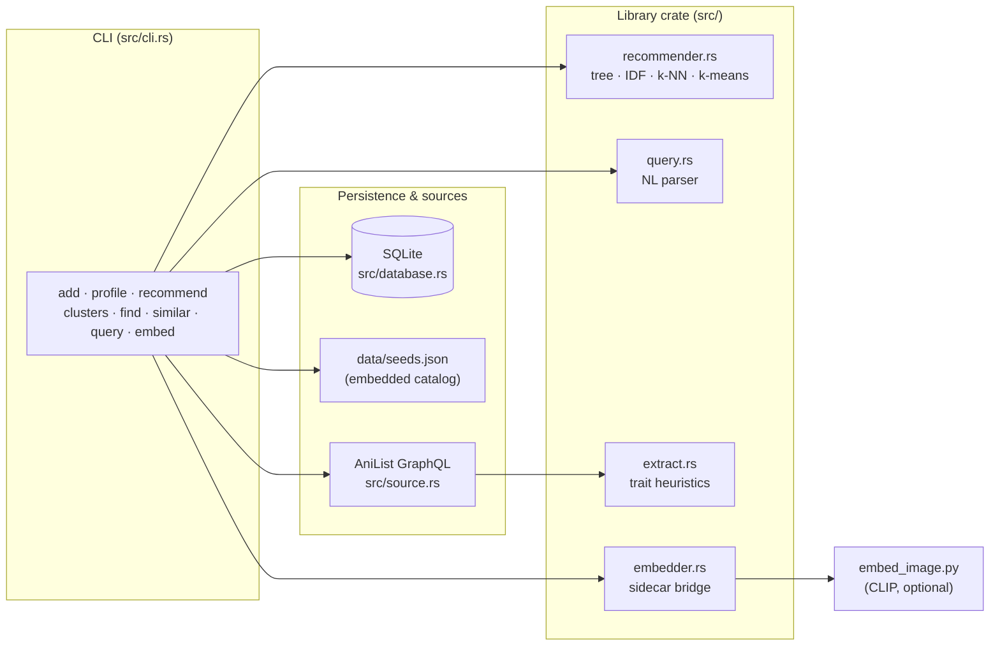
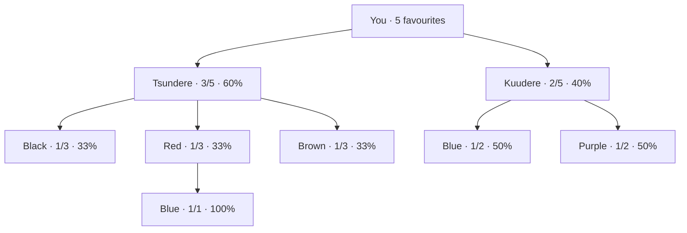

# Design

Sauce is a **local-first, single-binary** recommendation engine. This document
covers its architecture, data model, and the algorithms that turn a handful of
"characters I love" into ranked suggestions.

---

## Architecture



- **No server, no sync, no accounts.** The only outbound traffic is an AniList
  query when you `add` a character that isn't already in the embedded catalog.
- The **library crate** (`src/lib.rs`) holds all logic and is unit-tested in
  isolation; the **binary** (`src/main.rs` → `src/cli.rs`) is a thin shell.
- The **catalog** (`data/seeds.json`) is `include_str!`'d into the binary, so the
  tool is fully functional offline with zero setup.

---

## Data model

A single `Character` ([`src/models.rs`](src/models.rs)):

| Field | Type | Role |
|---|---|---|
| `archetype` | `String` | **primary split** + hard recommendation gate |
| `role` | `Option<String>` | Protagonist / Antagonist / Supporting / Rival |
| `hair_color`, `eye_color` | `Option<String>` | appearance |
| `gender`, `age` | `Option<…>` | demographic filters |
| `series`, `genres` | `String` / `Vec<String>` | relatedness / theme overlap |
| `popularity` | `Option<i64>` | AniList favourites — a soft prior |
| `image_url` | `Option<String>` | input to the visual embedder |
| `embedding` | `BLOB` (in DB) | L2-normalised CLIP vector |

The "library" is your favourites (the DB); the "catalog" is the candidate pool
(the embedded seeds, optionally augmented from AniList).

---

## Algorithms

### 1. Preference tree

Every favourite is a data point. The tree aggregates them level by level —
`archetype → hair → eye → age → role` — and the **dominant path** (the
highest-count child at each level, while confidence ≥ 50%) becomes "your type".

A real tree from `sauce profile --mermaid` over five favourites:



### 2. IDF-weighted scoring (`recommend`)

Instead of fixed attribute weights, each attribute value is weighted by how
*rare* it is among your favourites — TF-IDF, applied to taste:

```
idf(v) = ln(N / df(v)) + 1
```

where `N` = number of favourites and `df(v)` = how many have value `v`. If every
favourite is a Tsundere, that trait is uninformative (`idf = ln(1)+1 = 1.0`); a
trait only one favourite has is a strong distinguishing signal and is up-weighted.
**Archetype is a hard exclusion gate** — a candidate whose archetype isn't in
your tree scores exactly 0.

### 3. k-NN "vibe" vectors (`find --vibe-like`)

Each character is encoded as a normalised, weighted feature vector:

```
[ archetype ×3, role ×2, gender ×1.5, age ×1, popularity ×1, hair ×0.5, eye ×0.3 ]
```

Archetype and role dominate, so nearest-neighbour search by Euclidean distance
surfaces characters with a genuinely similar personality. Distance is converted
to a 0–100% similarity against the maximum possible distance for the weights.

### 4. k-means clustering (`clusters`, `recommend --by-cluster`)

People rarely have one "type". k-means over the cluster vectors finds the
distinct sub-tastes in your library. Initialisation is **deterministic**
(farthest-point seeding, no RNG) so results are reproducible across runs. `k` is
auto-chosen from library size, or set with `--k`.

### 5. Reference similarity (`similar`, attribute `find`)

`score_against(candidate, reference)` compares two characters dimension by
dimension. A dimension only contributes to the denominator when the *reference*
has that data, so missing fields never penalise a match and an identical
character scores a clean 100%. **Same-series** is weighted strongly (fans of one
cast member tend to like another), above incidental demographic overlap. Genre
similarity uses **Jaccard** over the genre sets.

### 6. Visual similarity (`find --looks-like`, optional)

`embed_image.py` loads a CLIP image encoder and emits an L2-normalised vector for
a character's art. Sauce caches it in SQLite and ranks `--looks-like` by
**cosine similarity**. The Rust core stays dependency-free: if Python or the
model is absent, ranking degrades to attribute similarity.

---

## Trait extraction & data quality

AniList returns factual fields but not structured hair/eye/archetype. Those are
inferred from the free-text description by a rule-based keyword extractor
([`src/extract.rs`](src/extract.rs)) — the same spirit as the natural-language
query parser. Curated seed data always overrides the heuristic, so the catalog
stays clean while AniList-sourced records are best-effort enriched.

---

## Testing

```bash
cargo test                              # 24 tests
cargo clippy --all-targets -- -D warnings
```

- **Unit tests** live beside each module (tree, IDF, k-NN, k-means, NL parser,
  extractor, DB round-trips).
- **Integration tests** (`tests/recommender_flow.rs`) drive the public library
  API end-to-end: load the catalog, build a library, persist it, and assert the
  recommender's gating and ranking behaviour.
